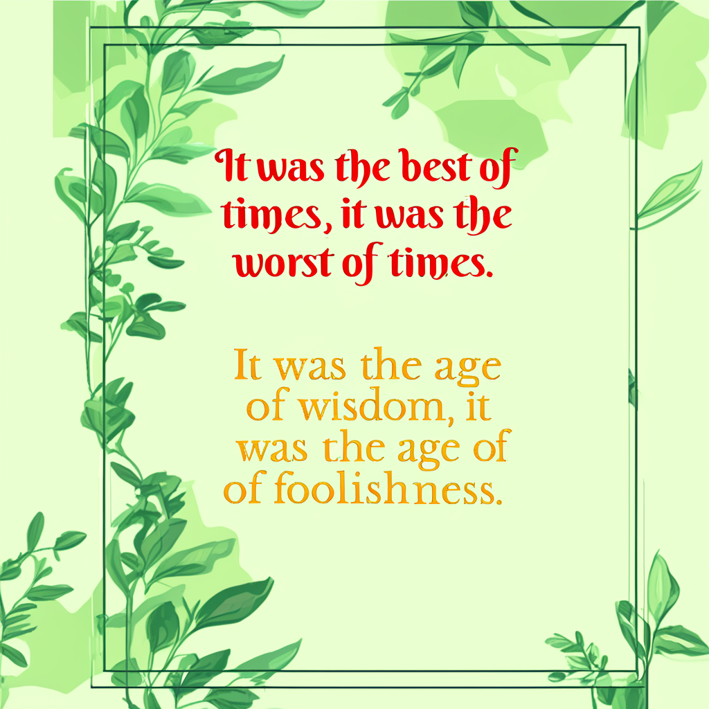
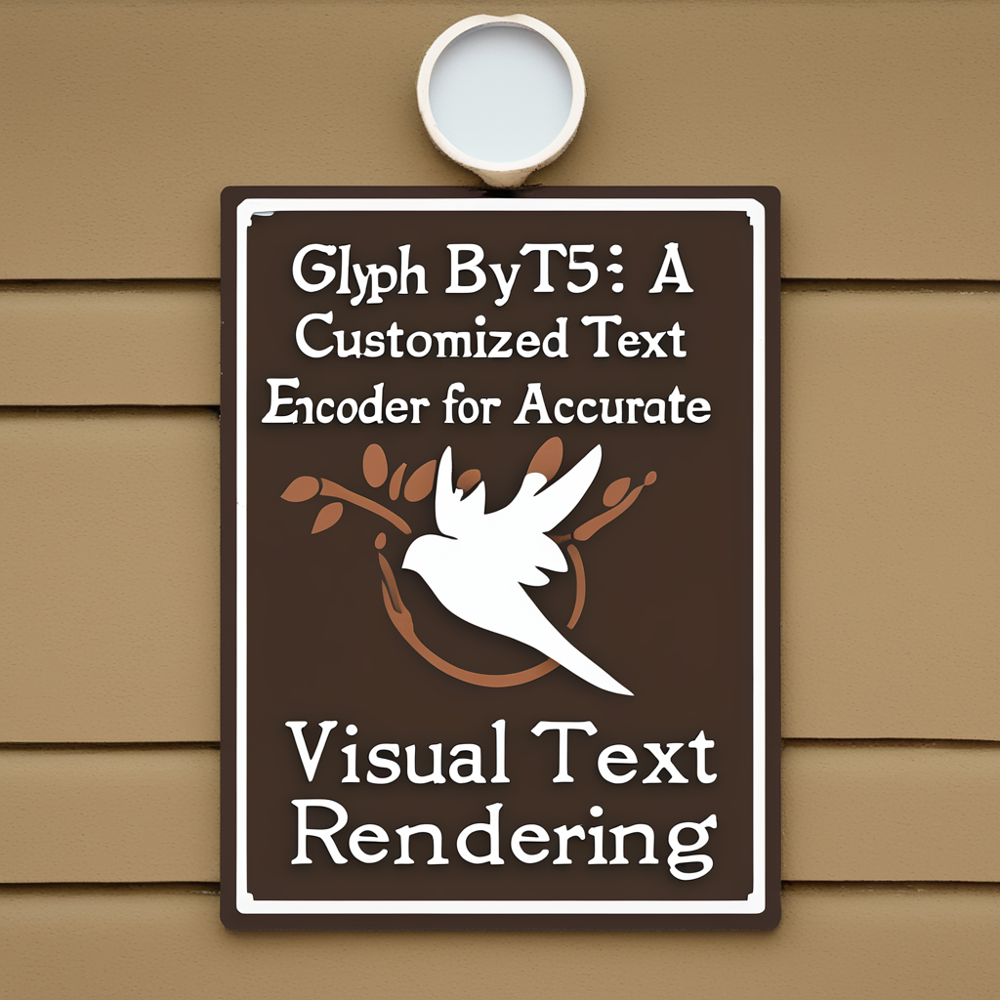

# Glyph-ByT5: A Customized Text Encoder for Accurate Visual Text Rendering


<a href='https://arxiv.org/abs/2403.09622'>

This is the official implementation of GlyphByT5, introduced in [Glyph-ByT5: A Customized Text Encoder for Accurate Visual Text Rendering](https://arxiv.org/abs/2403.09622). This repo contains the inference code for our proposed Glyph-SDXL model.

## News

⛽ ⛽ ⛽ Contact: [yuhui.yuan@microsoft.com](yuhui.yuan@microsoft.com) 

**2024.05.12** Release the checkpoints and inference codes. We now support visual text rendering in both Chinese and English.

## :high_brightness: Highlights

* We identify two crucial requirements of text encoders for achieving accurate visual text rendering: character awareness and alignment with glyphs. To this end, we propose a customized text encoder, Glyph-ByT5, by fine-tuning the character-aware ByT5 encoder using a meticulously curated paired glyph-text dataset.

* We present an effective method for integrating Glyph-ByT5 with SDXL, resulting in the creation of the Glyph-SDXL model for design image generation. This significantly enhances text rendering accuracy, improving it from less than 20% to nearly 90% on our design image benchmark. Noteworthy is Glyph-SDXL's newfound ability for text paragraph rendering, achieving high spelling accuracy for tens to hundreds of characters with automated multi-line layouts.

* We are expanding our method to multilingual glyph generation!

<table>
  <tr>
    <td></td>
    <td></td>
    <td></td>
    <td></td>
  </tr>
  <tr>
    <td></td>
    <td></td>
    <td></td>
    <td></td>
  </tr>
  <tr>
    <td></td>
    <td></td>
    <td></td>
    <td></td>
  </tr>
  <tr>
    <td></td>
    <td></td>
    <td></td>
    <td></td>
  </tr>
</table>


## :wrench: Installation

```
sudo docker pull pytorch/pytorch:2.2.0-cuda12.1-cudnn8-devel

pip install -r requirements.txt
```

## :wrench: Inference


```
python inference.py configs/glyph_sdxl_albedo.py [path-to-checkpoint-folder] [path-to-inference-ann-json] --out_folder [path-to-output-folder] --device cuda --sampler dpm/euler
```

Some sample annotations and results can be found in [examples/](examples/)

Annotations are organized as follows: 

```python
{
    # Specify the texts of each text box
    "texts": [
        "MAY ALLYOUR PRAYERS BE ANSWERED",
        "HAVE A HAPPY",
        "Easter Day"
    ],
    # Specify the color and font-type of each text box, available choice can be found under 'assets' folder.
    "styles": [
        {
            "color": "#5a741c",
            "font-family": "Gagalin-Regular"
        },
        {
            "color": "#5a741c",
            "font-family": "Gagalin-Regular"
        },
        {
            "color": "#5a741c",
            "font-family": "Brusher-Regular"
        }
    ],
    # Specify the box coordinates of each text box, each box is organized in [x, y, w, h]. Each coordinate is a ratio between [0, 1]. 
    "bbox": [
        [
            0.08267477203647416,
            0.5355623100303951,
            0.42857142857142855,
            0.07477203647416414
        ],
        [
            0.08389057750759879,
            0.1951367781155015,
            0.38054711246200607,
            0.03768996960486322
        ],
        [
            0.07537993920972644,
            0.2601823708206687,
            0.49544072948328266,
            0.14650455927051673
        ]
    ],
    # Background prompt.
    "bg_prompt": "Facebook Post. The image features a small bunny rabbit sitting in a basket filled with various flowers. The basket is placed on a yellow background, creating a vibrant and cheerful scene. The flowers surrounding the rabbit come in different sizes and colors, adding to the overall visual appeal of the image. The rabbit appears to be the main focus of the scene, and its presence among the flowers creates a sense of harmony and balance. Tags: green, yellow, minimalist, easter day, happy easter day, easter, happy easter, decoration, happy, egg, spring, selebration, poster, illustration, greeting, season, design, colorful, cute, template",
}
```

## :unlock: Available Checkpoints

[WIP]

## :open_hands: Demo

We provide a English version and a multilingual extension (supporting 1000 common Chinese characters and English) of our method. You can download our model weights to the `checkpoints/` directory and run:

```
python app.py
```

to try our English version, or run

```
python app_multilingual.py
```

to try our multilingual version.

## :mailbox_with_mail: Citation
If you find this code useful in your research, please consider citing:

```
@misc{liu2024glyphbyt5,
    title={Glyph-ByT5: A Customized Text Encoder for Accurate Visual Text Rendering},
    author={Zeyu Liu and Weicong Liang and Zhanhao Liang and Chong Luo and Ji Li and Gao Huang and Yuhui Yuan},
    year={2024},
    eprint={2403.09622},
    archivePrefix={arXiv},
    primaryClass={cs.CV}
}
